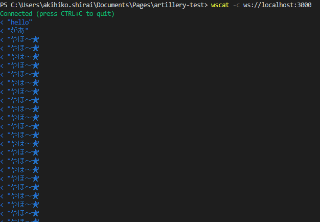

# artillery-test
artillery.io を使ってみるテスト

## Artillery とは何か

artillery.io の[公式ドキュメント](https://artillery.io/docs/guides/overview/why-artillery.html#What-kinds-of-services-can-I-test-with-Artillery)によると

Q: Artillery(砲兵)でどのようなサービスをテストできますか？
Artilleryは、バックエンド・システムのテストのために設計されています。つまり、APIサービス、eコマースのバックエンド、チャットシステム、ゲームのバックエンド、データベース、メッセージのやり取りとキュー（message brokers and queues）など、ネットワーク上で通信することができるあらゆるものを対象にしています。

話すプロトコルや記述言語に関係なく、バックエンドのテストに使用できます。Artilleryは、HTTP、WebSocket、Socket.ioをすぐにサポートし、プラグインを介してHLS、Kinesis、Kafkaなどの多くの追加プロトコルをサポートします。追加のプロトコルのサポートは、Artilleryのプラグインインターフェイスを介して追加できます。

Q:ArtilleryでWebUIをテストできますか？
A:いいえ、ArtilleryはWebフロントエンドをテストするようには設計されていません（つまり、ブラウザではなく、たとえばクライアント側のJavascriptを実行しません）。WebアプリケーションまたはWebサイトのUIをテストする必要がある場合は、テストスタックのその部分にCypress.ioを使用することをお勧めします。

とのことなのですが [Cypress.io](https://www.cypress.io/) については
https://qiita.com/okitan/items/b44882e28006c1be32b7
クロスブラウザテストを必要としないテストレベルに向きそう。
ということなので、ふつうに書いたほうが早いかもしれなん


## インストール

VSCode のコンソールにて

> npm install -g artillery

> artillery dino

なんか人みたいな花文字が出てきます（公式によるとASCII恐竜だそうです）

> artillery -V

今回は以下のバージョンでお送りします

Artillery: 1.6.1
Artillery Pro: not installed (https://artillery.io/pro)
Node.js: v12.16.3
OS: win32/x64

> artillery run --help 


  Usage: run [options] <script>

  Run a test script. Example: `artillery run benchmark.json`

  Options:

    -h, --help                    output usage information
    -t, --target <url>            Set target URL
    -p, --payload <path>          Set payload file (CSV)
    -o, --output <path>           Set file to write stats to (will output to stdout by default)
    -k, --insecure                Allow insecure TLS connections, e.g. with a self-signed cert
    -e, --environment <name>      Specify the environment to be used
    -c, --config <path>           Load test config from a file
    --overrides <JSON>            Object describing parts of the test script to override (experimental)
    -v, --variables <definition>  Set variables for the test dynamically (JSON object)
    -q, --quiet                   Do not print anything to stdout


> artillery run --output report.json my-script.yaml

JSON形式のレポートを取得できる

## テストのための環境をつくる

こちらを参考に「[WebSocket の負荷テストは Artillery でシュッと簡単に実行しよう](https://qiita.com/G-awa/items/5ecffe5bf2b68a1fa221)」…。


> npm install ws

server.js を書きます。

> node server.js

VSCodeのメニュー「Terminal」から「New Terminal」を開きます(Ctrl+Shift+@)。
ターミナルウインドウの右側に「2: Powershell」と表示されて切り替えることができます。
こちらで [wscat](https://github.com/websockets/wscat) をインストールします。

 > npm install -g wscat

 > wscat -c ws://localhost:3000 

これで hello と打てば他のクライアントにブロードキャストされるリピーターができました。

Ctrl+Shift+@でターミナルを増やして、`` wscat -c ws://localhost:3000 `` で接続してたくさん増やしてみましょう。

## Artillery を使用して負荷テストを実行する
さて Artillery を使用して負荷テストをかけてみます。
シナリオファイルを新規作成して scenario.yml として保存しておきます。

```scenario.yml
config:
  target: "ws://localhost:3000"
  phases:
    - duration: 20
      arrivalRate: 10
scenarios:
  - engine: "ws"
    flow:
      - send: "やほ～★"
```

あたらしいターミナルを開いて ``artillery run scenario.yml`` します

```
Started phase 0, duration: 20s @ 11:55:21(+0900) 2020-10-08
Report @ 11:55:31(+0900) 2020-10-08
Elapsed time: 10 seconds
  Scenarios launched:  99
  Scenarios completed: 99
  Requests completed:  99
  Mean response/sec: 10.03
  Response time (msec):
    min: 0.1
    max: 0.5
    median: 0.1
    p95: 0.1
    p99: 0.5
  Codes:
    0: 99

Report @ 11:55:41(+0900) 2020-10-08
Elapsed time: 20 seconds
  Scenarios launched:  100
  Scenarios completed: 100
  Requests completed:  100
  Mean response/sec: 10.02
  Response time (msec):
    min: 0.1
    max: 1.6
    median: 0.1
    p95: 0.1
    p99: 1.1
  Codes:
    0: 100

Report @ 11:55:42(+0900) 2020-10-08
Elapsed time: 20 seconds
  Scenarios launched:  1
  Scenarios completed: 1
  Requests completed:  1
  Mean response/sec: 2
  Response time (msec):
    min: 0.1
    max: 0.1
    median: 0.1
    p95: 0.1
    p99: 0.1
  Codes:
    0: 1

All virtual users finished
Summary report @ 11:55:42(+0900) 2020-10-08
  Scenarios launched:  200
  Scenarios completed: 200
  Requests completed:  200
  Mean response/sec: 9.8
  Response time (msec):
    min: 0.1
    max: 1.6
    median: 0.1
    p95: 0.1
    p99: 0.5
  Scenario counts:
    0: 200 (100%)
  Codes:
    0: 200
```



無事に全ターミナルに文字列を送ってくれたようです。

ここでconfigセクションを見直してみます。

 - target : テスト対象のアプリケーションのURI。HTTPアプリケーションの場合、これはすべてのリクエストのベースURL ``http://myapp.staging.local``。 WebSocketサーバーの場合、サーバーのホスト名（およびオプションでポート）``ws://127.0.0.1`` になります。
 - environments : 環境のリストと関連するターゲットURLを指定します。
 - phases : テストの期間とリクエストの頻度を指定します。
 - payload : CSVファイルから変数をインポートするために使用されます。
 - variables : 変数を外部CSVファイルからロードするのではなく、インラインで設定します
 - defaults : すべてのHTTPリクエストに適用されるデフォルトのヘッダーを設定します
 - plugins : プラグインを構成します
 - processor : カスタムJSコードをロードします
 - tls : Artilleryが自己署名証明書を処理する方法を構成します。HTTPリファレンスを参照してください
 - ensure : 待ち時間またはエラー率の成功条件を設定します。CI / CDに役立ちます

というわけで ``phases`` の ``duration: 2`` などすると2回になります。


ペイロードを載せたり、待ち時間を ``think``で追加できるようなのでこれは使えそう（作業はまたの機会に）。

## 参考文献

- [ARTILLERY:Installing](https://artillery.io/docs/guides/getting-started/installing-artillery.html#Installing)
- [WebSocket の負荷テストは Artillery でシュッと簡単に実行しよう @G-awa 2020年03月22日](https://qiita.com/G-awa/items/5ecffe5bf2b68a1fa221)

